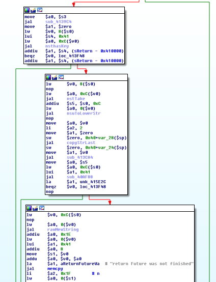
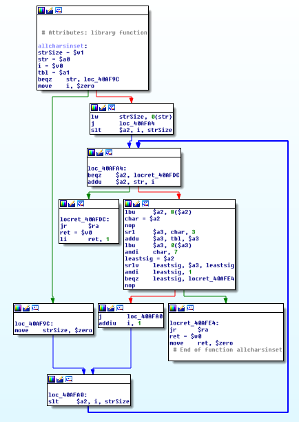
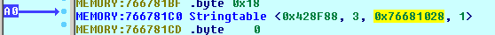
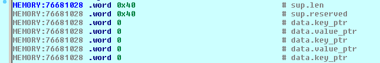
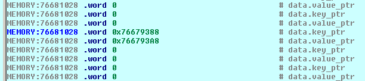
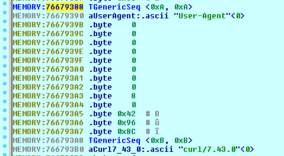

# Pwn2Win CTF 2016: Suspect Router

**Category:** Reverse
**Points:** 100
**Solves:** 0
**Description:**

> We have found this suspect binary in one of the SKY project routers.
> We suspect that the Club installs this binary to mark the enemy networks
> intruded by them, and that hidden information exists inside the binary
> which can be obtained via network. Find which information is that.

Beware that old versions of qemu have a bug which prevent this binary from being emulated correctly. We recommend emulating it in **qemu-user >= 2.3.0** or running it in a real router.


## Write-up


### Setting up the emulation environment

The [admpanel](admpanel) file is a MIPS binary which runs in OpenWRT routers, as you might suspect from the problem statement and also from inspecting the toolchain used to compile it:

```
$ strings admpanel | grep -i gcc
[...]
GCC: (OpenWrt/Linaro GCC 4.8-2014.04 r42625) 4.8.3
```

The binary can thus be run using the qemu-user emulator for the MIPS architecture, which allows a debugger to be attached using the GDB protocol. The debugger might be GDB itself or even IDA Pro, which supports the GDB protocol.

But before running the binary, we need to get the OpenWRT system libraries. We might as well download the entire SDK. Looking at the GCC version string, it is easy to find the [correct SDK](https://downloads.openwrt.org/barrier_breaker/14.07/ar71xx/generic/OpenWrt-SDK-ar71xx-for-linux-x86_64-gcc-4.8-linaro_uClibc-0.9.33.2.tar.bz2) in the OpenWRT downloads page.

Once the SDK is extracted, you can setup the directory used by qemu to look for libraries by typing:

```
export QEMU_LD_PREFIX=${OPENWRT_SDK_ROOT}/staging_dir/toolchain-mips_34kc_gcc-4.8-linaro_uClibc-0.9.33.2
```

After that, the binary can be run by calling:

```
qemu-mips ./admpanel
```

If you want qemu to wait for a debugger to be attached before running the binary, use the `-g` command line option, passing the port on which the debugger will listen:

```
qemu-mips -g 1234 ./admpanel
```


### Preliminary behavior inspection

From the problem statement, we know hidden information exists inside the binary which can be obtained **via network**. Therefore we first check to see if the process is listening at any port:

```
$ netstat -tnap
Proto Recv-Q Send-Q Local Address           Foreign Address         State       PID/Program name
tcp        0      0 0.0.0.0:8080            0.0.0.0:*               LISTEN      29454/qemu-mips
```

By looking at strings such as `"HTTP/1.1"`, `"200 OK"`, `"Content-Length: "`, `"asynchttpserver.processClient"` and many others which exist in the binary, one can easily guess this is a HTTP server. So let us see if we can get it to answer a HTTP request:

```
$ curl -v 'http://localhost:8080/'
*   Trying 127.0.0.1...
* Connected to localhost (127.0.0.1) port 8080 (#0)
> GET / HTTP/1.1
> Host: localhost:8080
> User-Agent: curl/7.43.0
> Accept: */*
>
< HTTP/1.1 403 Forbidden
< Content-Length: 13
<
* Connection #0 to host localhost left intact
Access Denied
```


### Identifying the programming language

By Googling strings contained in the binary such as `"SIGSEGV: Illegal storage access. (Attempt to read from nil?)"` or `"asynchttpserver.processClient"`, we find the program was originally written in the [Nim programming language](http://nim-lang.org).


### Generating FLIRT signatures

Nim translates the program to C before compiling, which is good news since we are essentially dealing with *C on steroids*, adopting e.g. the usual C calling convention. The Nim standard library is statically linked into the executable, which means IDA Pro's FLIRT signatures might save us a lot of time.

We start with a *hello world* web server in Nim which mimics the behavior we have seen until now from the binary being analyzed:

```
import asynchttpserver, asyncdispatch
var server = newAsyncHttpServer()
proc cb(req: Request) {.async.} =
        await req.respond(Http403, "Access Denied")
waitFor server.serve(Port(8080), cb)
```

Now we [compile](flirt/Makefile) this file with Nim, assemble a static library file from the objects (`*.o`) generated in the `nimcache` directory, and use it to generate a [FLIRT signature](flirt/nimstdlib.sig). As the analysis proceed, we can insert [more code](flirt/nimstdlib.nim) to call other standard library procedures in order to get them included in the FLIRT signature.

The [FLIRT signature file](flirt/nimstdlib.sig) is intended to be copied to the `sig/mips` directory inside the IDA Pro installation.


### Static analysis with IDA Pro

After opening the binary in IDA Pro, the FLIRT signature can be loaded using the `File → Load file → FLIRT signature file...` menu. Just select the `nimstdlib` signature and it will be applied.

Now, it would be a nightmare to get to the request handler by following the code from the `main` function onwards, because this program is written using Nim's asynchronous procedures, for which the compiler generates FSMs and lots of indirection.

But we are lucky because we can look for cross-references to strings, such as the `"Access Denied"` which the program replies as an answer to our requests. However, we need to remember that the Nim string type extends `TGenericSeq` (defined below), so before the ASCII characters, there are 8 bytes containing the string length repeated twice (well, strictly speaking, `reserved` can contain a number bigger than `len`).

```
TGenericSeq     struc  # (sizeof=0x8, mappedto_1).
len:            .word ?
reserved:       .word ?
TGenericSeq     ends
```

So the `"Access Denied"` string is represented as follows:

```
.rodata:00415DE0 sAccessDenied:  TGenericSeq <0xD, 0xD>   # DATA XREF: sub_413D20+240↑o
.rodata:00415DE8 aAccessDenied:  .ascii "Access Denied"<0>
```

Following its cross-reference we get to a very interesting function:



Above, the `nsthasKey` and `nstTake` references were not detected by our original FLIRT signature, but if we look at the `nstTake` function, it contains a reference to the `"key not found: "` string. Grepping through Nim standard library code, we see it is used by a template whose purpose is to get values from string tables. After adding some pointless `strtab` manipulation to [nimstdlib.nim](flirt/nimstdlib.nim), we finally get these included in the FLIRT signature.

Before we go further on, first a MIPS calling convention crash course:

 * Before the call, `$a0`, `$a1`, `$a2`, ... contain the arguments to a function.

 * After the call, `$v0` contains the returned value.

Besides, always remember that MIPS has a branch delay slot, so the instruction just after a branch or jump is always executed, before the jump is effectively taken.

By analyzing the flow, we can see that some action happens when the branch `beqz $v0, loc_413F48` is not taken. For the execution flow to get there at the first place, the string table at the `0xC($v0)` address needs to contain a `"Return"` key (call to `nsthasKey`). The value corresponding to this key is taken from the string table (call to `nstTake`). It is then converted to lower case (call to `nsuToLowerStr`), and only the first 3 chars are copied from it (call to `copyStrLast`, to which the second and third arguments are `0` and `2`).

In order to understand the `beqz $v0, loc_413F48` branch, we need to analyze `sub_413CA4` and `sub_40AF88`. It turns out that `sub_413CA4` is easy — it is equivalent to issuing the `sw $a1, 0($a0)` instruction (look the code at `0x00413D0C`), after doing some garbage collector bookkeeping. Thus we see that `sub_40AF88` receives as its first argument the substring returned by `copyStrLast`, and some table contained in `unk_415E2C` as its second argument.



Above we have the `sub_40AF88` disassembly graph. The function receives a string `str` as the first argument, and a bitmap `tbl` as the second argument. It consists of a loop which iterates over the string chars and returns true (`1`) only if no char is found to be outside the bitmap. In order to lookup a char in the bitmap, its value is divided by 8 (`srl $a3, char, 3`). Then the division remainder (`andi char, 7`) is used to look at a specific bit (`srlv leastsig, $a3, leastsig`) of this 8-bit value.

Analyzing the bitmap located at `unk_415E2C`, we see that it contains the chars `'0'..'9'`, `'A'..'F'` and `'a'..'f'`, i.e. hex digits.

**Summing all up**, the string we are looking for has at most 3 chars, and consists of lowercase hex digits.


### Modeling the string table in IDA Pro

By looking at the `nimcache/stdlib_strtabs.c` file inside a Nim project, we can find how the structure is supposed to appear in memory:

```
struct  TNimObject  {
TNimType* m_type;
};
struct  Stringtableobj140209  {
  TNimObject Sup;
NI counter;
Keyvaluepairseq140207* data;
NU8 mode;
};
struct Keyvaluepairseq140207 {
  TGenericSeq Sup;
  Keyvaluepair140205 data[SEQ_DECL_SIZE];
};
struct Keyvaluepair140205 {
NimStringDesc* Field0;
NimStringDesc* Field1;
};
```

Let us map that to a bunch IDA Pro structures:

```
Stringtable     struc  # (sizeof=0xD, mappedto_2)
m_type_ptr:     .word ?
counter:        .word ?
keyvaluepairseq_ptr:.word ?
mode:           .byte ?
Stringtable     ends

 # ---------------------------------------------------------------------------

Keyvaluepairseq struc  # (sizeof=0x208, mappedto_3)
sup:            TGenericSeq ?
data:           Keyvaluepair 64 dup(?)
Keyvaluepairseq ends

 # ---------------------------------------------------------------------------

Keyvaluepair    struc  # (sizeof=0x8, mappedto_4)  # XREF: Keyvaluepairseq/r
key_ptr:        .word ?
value_ptr:      .word ?
Keyvaluepair    ends
```


### Debugging with IDA Pro

Of course we could read [asynchttpserver docs](http://nim-lang.org/docs/asynchttpserver.html) and find out that the only string table you could get from the request which would make any sense consists of the **HTTP request headers**, a hypothesis which, by the way, can be promptly tested by running `curl -H 'Return: 123' -v http://localhost:8080/`.

But debugging is endless joy, so now let us call the executable passing `-g 1234` as argument to `qemu-mips` and fire the IDA Pro debugger.

Setting a breakpoint at `0x00413D74` (`jal nsthasKey`), we can inspect the memory location referenced by `$a0`, which should contain a string table. If we run `curl http://localhost:8080/`, we trigger the breakpoint.

Now we navigate the memory, starting from the address referenced by `$a0`, and always typing `Alt+Q` when we find something which should be represented as one of our structures:









So yes, the string table contains HTTP request headers.


### Finding the string

Until now, we know we need to pass 3 lowercase hex digits as the `Return` header to the server. But which 3 lowercase hex digits?

If we pass some incorrect string, we get garbage back in the answer's `Return` header:

```
$ curl -H 'Return: 123' -v http://localhost:8080/
*   Trying 127.0.0.1...
* Connected to localhost (127.0.0.1) port 8080 (#0)
> GET / HTTP/1.1
> Host: localhost:8080
> User-Agent: curl/7.43.0
> Accept: */*
> return: 123
>
< HTTP/1.1 403 Forbidden
< Return: {{some seemingly random garbage}}
< Content-Length: 13
<
* Connection #0 to host localhost left intact
Access Denied
```

We might try to understand the rest of the code, but the search space is so small that we might rather just bruteforce the string.

In one terminal, we start the emulator (without enabling the debugger). In other terminal, we call the [bruteforce.py](bruteforce.py) script. After 3 seconds, the flag should be found:

```
$ ./bruteforce.py
key: f21
flag: CTF-BR{naVcO_you_found_it_PQZ0a}
```


## Other write-ups and resources

* [Challenge source code](https://github.com/epicleet/binrev-2016/tree/master/suspect_router)
